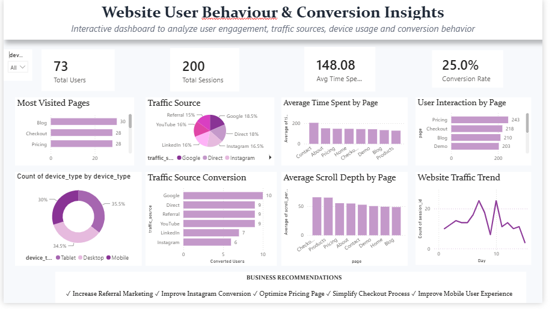

# Website User Behaviour & Conversion Insights

An interactive analytics project that analyzes website user engagement, traffic sources, device usage, and conversion behavior using **Python** and **Power BI**.

---

## Project Overview

This project focuses on understanding how users interact with a website and identifying factors that influence conversions.

The analysis includes:

- Most Visited Pages
- Traffic Source Analysis
- Average Time Spent by Page
- User Interaction by Page
- Device Usage Patterns
- Average Scroll Depth
- Website Traffic Trends
- Conversion Rate Analysis

---

## Tools & Technologies

- Python
- Pandas
- NumPy
- Matplotlib
- Google Colab
- Power BI

---

## Dataset

The dataset contains website user behavior information such as:

- Sessions
- Traffic Sources
- Page Visits
- Device Types
- Scroll Depth
- Time Spent
- Conversion Status

Dataset file:

```text
processed_website_data.csv
```

---

## Files in this Repository

| File | Description |
|------|-------------|
| Website_Behaviour_Analytics.ipynb | Python analysis notebook |
| processed_website_data.csv | Cleaned dataset |
| Website user interaction dashboard.pbix | Power BI dashboard |
| Dashboard.png.png | Dashboard screenshot |
| README.md | Project documentation |

---

## Dashboard Preview

Upload your dashboard screenshot and use:

```markdown

```

After uploading, GitHub will display the image automatically.

---

## Key Insights

- Blog and Checkout pages receive high user engagement.
- Google is one of the major traffic sources.
- Mobile devices contribute a significant share of website visits.
- Pricing and Checkout pages show strong conversion potential.
- Scroll depth decreases on informational pages, indicating optimization opportunities.

---

## Business Recommendations

✔ Increase Referral Marketing

✔ Improve Instagram Conversion Strategy

✔ Optimize Pricing Page Experience

✔ Simplify Checkout Process

✔ Improve Mobile User Experience

✔ Focus on High-Converting Traffic Sources

---

## Future Improvements

- Customer Segmentation
- Conversion Prediction using Machine Learning
- Real-time Dashboard Integration
- AI-generated Business Insights

---

## Author

**Annalin Femi J K**

AI & Machine Learning Internship Task 3

Website User Behaviour & Conversion Insights
